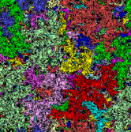

<!-- Profile Section -->

    <h2> Personal Statement</h2>
    

        
        

            

                I am currently seeking <strong>Ph.D. opportunities in Mathematical Statistics and Mathematical Statistical Physics</strong>, with a strong emphasis on the mathematical foundations of stochastic systems and random processes. My research lies at the intersection of <strong>randomness, geometry, and complex dynamical systems</strong>, where I study how local stochastic interactions give rise to emergent macroscopic behavior.
            

            
            

                My approach combines rigorous mathematical analysis with computational methods to explore phenomena across scales—from microscopic particle interactions to macroscopic phase transitions in complex systems.
            

            
            <h3> Core Research Interests</h3>
            <ul class="research-interests">
                <li><strong>Complex Systems & Emergent Phenomena</strong></li>
                <li><strong>Probability Theory & Stochastic Processes</strong></li>
                <li><strong>Percolation Theory & Phase Transitions</strong></li>
                <li><strong>Interacting Particle Systems</strong></li>
                <li><strong>Stochastic & Random Geometry</strong></li>
            </ul>
            
            <h3> Research Vision</h3>
            

                My work bridges discrete and continuous stochastic modeling with applications in <strong>statistical mechanics, percolation theory, random geometry, and interacting particle systems</strong>. I aim to advance the theoretical understanding of <strong>probability, mathematical physics, and statistical geometry</strong> through rigorous mathematical analysis and formulation.
            

            
            <h3> Applied & Collaborative Work</h3>
            

                Alongside my academic pursuits, I engage in <strong>Data Science and MLOps projects</strong>, applying statistical modeling and computational techniques to solve real-world problems.
            

        

    

<!-- Publications Section -->

    <h2> Projects & Portfolios</h2>
    

<!-- CSS Styles -->

